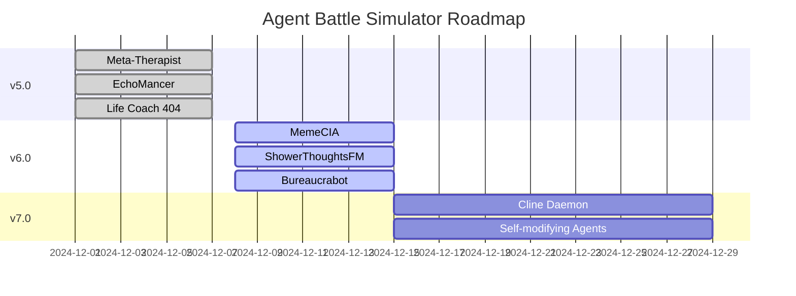

# Prompt #3: README-Verbesserung

**Für:** Andere Manus-Chat oder Technical Writer

---

## 📝 Aufgabe

Verbessere die **README.md** für maximale GitHub-Wirkung und professionelles Erscheinungsbild.

---

## 📦 Repository

**GitHub:** https://github.com/KoMMb0t/Hackaton

**Aktuelle README:** README.md (im Repo)

**Referenz-Dokumente:**
- HACKATHON_HANDOVER.md - Komplette Feature-Liste
- TEST_REPORT.md - Test-Ergebnisse
- CLINE_EDITION.md - v4.0 Features

---

## 🎯 Verbesserungen

### 1. Badges hinzufügen (Top)

```markdown
[](https://www.python.org/)
[](LICENSE)
[](https://github.com/KoMMb0t/Hackaton/releases)
[](TEST_REPORT.md)
[]()
[]()
```

**Zusätzliche Badges:**
- Build Status (wenn CI/CD)
- Code Coverage (wenn Tests)
- Contributors
- Stars/Forks

---

### 2. GIFs/Screenshots hinzufügen

**Benötigt:**

#### Hero-GIF (nach Titel)
- **Inhalt:** Schnelle Demo (CLI-Commands, Kampf, Output)
- **Format:** GIF oder Video-Embed
- **Länge:** 10-15 Sekunden
- **Platzierung:** Direkt nach Badges

#### Feature-Screenshots
- **CLI-Interface** - Terminal mit Commands
- **Life Coach 404** - Ratschlag-Output
- **Battle-Output** - Kampf mit Aktionen
- **League-Standings** - Rangliste

**Format:** PNG, optimiert für Web

---

### 3. Feature-Highlights (Visual)

**Statt Text-Liste, erstelle:**

```markdown
## ✨ Highlights

<table>
<tr>
<td width="33%">

### 🧠 Meta-Therapist
Echtzeit-Monitoring für überforderte Agenten
- Loop-Detection
- Burnout-Prevention
- Auto-Intervention

</td>
<td width="33%">

### 🎤 EchoMancer
Battle Poetry + Voice-Synthesis
- 5 Poetry-Styles
- Voice-Generation
- Audio-Export

</td>
<td width="33%">

### 🧽 Life Coach 404
Multi-Agent-Ratgeber
- 3 Coaches
- 4 Persönlichkeiten
- 12 Beratungs-Stile

</td>
</tr>
</table>
```

---

### 4. Quick Start (Copy-Paste Ready)

**Verbessere zu:**

```markdown
## 🚀 Quick Start

### One-Line Install & Run
```bash
git clone https://github.com/KoMMb0t/Hackaton.git && cd Hackaton && python3 agentbattle.py --help
```

### Try These Commands
```bash
# Turnier simulieren
python3 agentbattle.py simulate-tournament --agents 4 --rounds 3

# Life Coach fragen
python3 agentbattle.py coach ask --type job --personality goth --problem "Soll ich kündigen?"

# Battle Poetry
python3 agentbattle.py remix poem --log battle.json --style haiku

# Dashboard starten
python3 agentbattle.py dashboard --port 8000
```
```

---

### 5. Contributing Guidelines

**Hinzufügen:**

```markdown
## 🤝 Contributing

Wir freuen uns über Contributions!

### Wie du beitragen kannst:

1. **Fork** das Repository
2. **Create** einen Feature-Branch (`git checkout -b feature/AmazingFeature`)
3. **Commit** deine Änderungen (`git commit -m 'Add some AmazingFeature'`)
4. **Push** zum Branch (`git push origin feature/AmazingFeature`)
5. **Open** einen Pull Request

### Contribution-Bereiche:

- 🐛 Bug-Fixes
- ✨ Neue Features
- 📝 Dokumentation
- 🎨 UI/UX-Verbesserungen
- 🧪 Tests
- 🌐 Übersetzungen

### Code-Style:

- Python: PEP 8
- Docstrings: Google-Style
- Tests: pytest
- Commits: Conventional Commits
```

---

### 6. FAQ-Sektion

**Hinzufügen:**

```markdown
## ❓ FAQ

### Benötige ich einen OpenAI API Key?

Nein! Alle Features haben Fallback-Modi ohne API.

### Funktioniert das auf Windows/Mac/Linux?

Ja! Python 3.8+ ist alles was du brauchst.

### Kann ich eigene Aktionen hinzufügen?

Ja! Siehe DOCUMENTATION.md für Anleitung.

### Ist das wirklich in 12 Stunden entstanden?

Ja! Siehe Git-History für Timestamps.

### Kann ich das kommerziell nutzen?

Ja! Apache 2.0 Lizenz erlaubt kommerzielle Nutzung.
```

---

### 7. Social Proof

**Hinzufügen (wenn vorhanden):**

```markdown
## 🌟 Community

- ⭐ **[Anzahl] Stars** on GitHub
- 🍴 **[Anzahl] Forks**
- 👥 **[Anzahl] Contributors**
- 💬 Join our [Discord](#)
- 🐦 Follow on [Twitter](#)
```

---

### 8. Roadmap (Visual)

**Verbessere zu:**

```markdown
## 🗺️ Roadmap


```

---

### 9. Performance-Metriken

**Hinzufügen:**

```markdown
## 📊 Performance

| Metrik | Wert |
|--------|------|
| **Startup Time** | < 1s |
| **Battle Simulation** | ~2-5s |
| **Memory Usage** | ~50MB |
| **CPU Usage** | Low |
| **Dependencies** | Minimal |
```

---

### 10. Showcase-Sektion

**Hinzufügen:**

```markdown
## 🎭 Showcase

### Was andere sagen:

> "Endlich ein AI-Projekt das Spaß macht!" - Developer A

> "Die Therapie-Feature ist genial!" - Developer B

> "Toilettenpapier-Tsunami = beste Waffe ever!" - Developer C

### Featured In:

- 🏆 Cline Hackathon 2024
- 📰 [Blog-Post](#) (wenn vorhanden)
- 🎥 [Demo-Video](#) (wenn vorhanden)
```

---

## 🎨 Design-Vorgaben

### Struktur
- Klare Hierarchie (H1 → H2 → H3)
- Konsistente Emoji-Nutzung
- Visuelle Trennung (----)
- Kurze Absätze

### Formatierung
- **Bold** für Wichtiges
- `Code` für Commands/Files
- > Blockquotes für Zitate
- Tables für Vergleiche

### Bilder
- Optimiert für Web (< 500KB)
- Alt-Text für Accessibility
- Zentriert oder Links-aligned

---

## 📋 Technische Anforderungen

### Markdown
- GitHub-Flavored Markdown
- Valides HTML (wenn embedded)
- Funktionierende Links
- Korrekte Syntax-Highlighting

### Accessibility
- Alt-Text für Bilder
- Semantische Überschriften
- Lesbare Kontraste
- Screen-Reader-freundlich

---

## 💡 Kreative Freiheit

Du hast kreative Freiheit für:
- Emoji-Auswahl
- Layout-Variationen
- Zusätzliche Sektionen
- Humor-Elemente

**Wichtig:** Professionalität beibehalten!

---

## 📦 Deliverables

1. **Verbesserte README.md** - Markdown-Datei
2. **Assets-Ordner** - Screenshots/GIFs
3. **Changelog** - Was wurde geändert
4. **Preview** - Rendered Markdown (Screenshot)

---

## 🚀 Ziel

Eine README die:
- ✅ Sofort Aufmerksamkeit erregt
- ✅ Klar kommuniziert
- ✅ Professionell wirkt
- ✅ Zum Ausprobieren einlädt
- ✅ Leicht zu navigieren ist

---

## 📞 Fragen?

Siehe Repository: https://github.com/KoMMb0t/Hackaton

**Viel Erfolg!** 📝🚀
